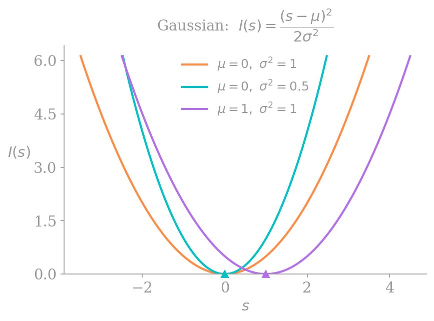
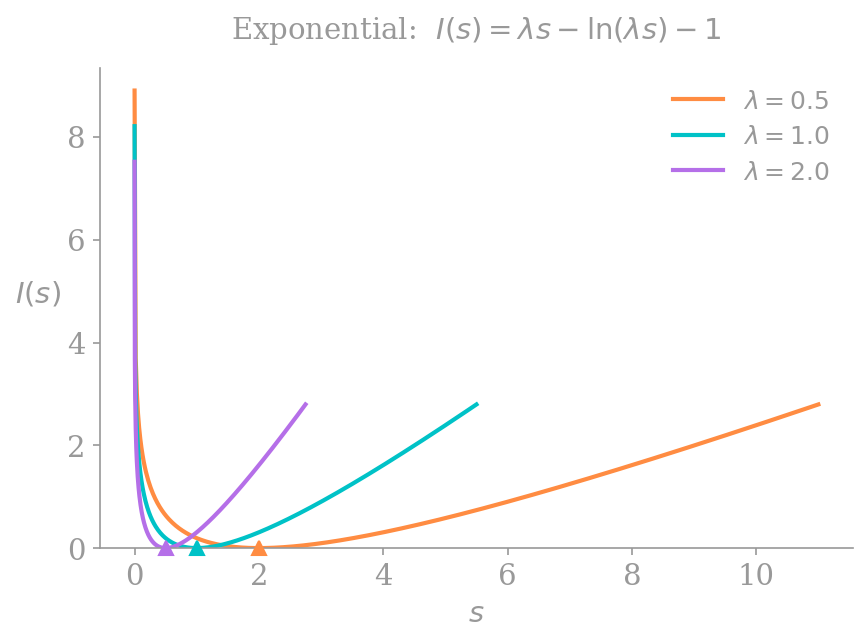
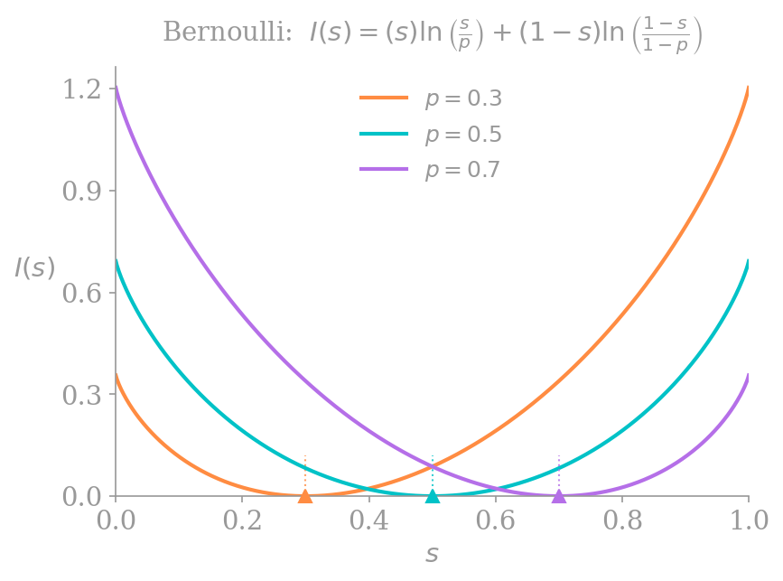



## Why care about large deviations at all?
Let's say I have some independent and identically distributed (iid) random variables (RVs) $X_1, X_2, \dots, X_{n}$ such that $\mathbf{E}[X] = \mu$, and I take the sample mean:
\[
    S_{n} = \frac{1}{n} \sum_{i = 1}^{n} X_{i}.
\]
Maybe I am afraid of very big numbers, so assume that it'd be really bad if this sample mean was *too large*. To quell my fear, let's try to bound the probability that $S_{n}$ is greater than $\mu + a$ for some $a > 0$. That is, we want an approximation for 
\[
    \Pr \left[S_{n} > \mu + a\right],
\]
the probability of a *large deviation.* 

You might be wondering if we can simply apply the central limit theorem (CLT) here. After all, it tells us the exact form of the distribution of $S_{n}$, so shouldn't it be quite helpful for this bound? Unfortunately it isn't. The main problem is that the CLT lets us make statements about $O(1/\sqrt{n})$ fluctuations, but we're interested in $O(1)$ fluctuations in large deviations. Define
\[
    Z_{n} = \sqrt{n}\frac{S_{n} - \mu}{\sigma},
\]
and recall that 
\[
    \Pr \left[Z_{n} > z \right] = \Pr \left[S_{n} > \mu + z \frac{\sigma}{\sqrt{n}}\right] \approx 1 - \Phi(z),
\]
where $\Phi$ denotes the Gaussian cumulative distribution function. Notice here that our fluctuation of interest $z(\sigma/\sqrt{n})$ polynomially decays in $n$, i.e., it can only ever capture $O(1/\sqrt{n})$ fluctuations.[^1] This is a problem, though, because in large deviations we're interested in 
\[
    \Pr \left[S_{n} > \mu + a\right],
\]
where $a > 0$ is some constant *independent* of $n$. In this setting, as $n$ grows, the point of interest should not get closer to $\mu$; it should remain far out in the tail of the distribution.

We can further see why this is a problem in the [Berry-Esseen theorem](https://en.wikipedia.org/wiki/Berry%E2%80%93Esseen_theorem), which states that
\[
    \underset{z}{\sup} \left| \Pr \left[\sqrt{n}\frac{S_{n} - \mu}{\sigma} \leq z\right] - \Phi(z) \right| \leq \frac{C}{\sqrt{n}},
\]
i.e., the [Kolmogorov-Smirnov Distance](https://en.wikipedia.org/wiki/Kolmogorov–Smirnov_test)[^2] between the CLT Gaussian and a true Gaussian is accurate up to order $O(1/\sqrt{n})$. As we will soon see, however, this is totally useless! In reality, 
\[
    \Pr \left[S_{n} > \mu + a \right] \approx e^{-nc}.
\]
This obviously decays much faster than $O(1/\sqrt{n})$, making the CLT's bound---which is absolute, and much larger than $e^{-nc}$, thus allowing for negative probabilities!---rather unhelpful. Thus, we need a new tool.

## First, a few observations.
First, I'm going to make a claim. 

**Claim.** Let's say we have independent and identically distributed (iid) random variables $X_1, X_2, \dots, X_{n}$, and let's assume they're generally well-behaved. Define
\[
    S_{n} = \frac{1}{n}\sum_{i = 1}^{n} X_{i},
\]
which is simply the sample mean. Then, the probability that the sample mean is equal to some value, say $s$, is approximately given by
\[
    f_{S_{n}}(s) \approx C \cdot \exp\left(-n I(s) \right),
\]
for some function $I(s)$. 

### Some Examples

I wouldn't blame you for not believing the above claim, I didn't give you any reason to! But let's test it out on some canonical distributions.

#### Gaussian Random Variables

First, let $X_1, X_2, \dots, X_{n} \overset{\mathrm{iid}}{\sim} \mathcal{N}(\mu, \sigma^{2})$. We know from some basic statistical theory that
\[
    S_{n} \sim \frac{1}{n} \mathcal{N}(n\mu, n\sigma^{2}) \equiv \mathcal{N} \left(\mu, \sigma^{2}/n \right).
\]
Therefore, the density of $S_{n}$ can be written as
\[
    f_{S_{n}}(s) = \frac{1}{\sqrt{2\pi \sigma^{2}/n}} \exp \left( - \frac{(s - \mu)^{2}}{2(\sigma^{2}/n)}  \right).
\]
We can pull the $n$'s out of the denominators to get
\[
    f_{S_{n}}(s) = \frac{\sqrt{n}}{\sqrt{2\pi \sigma^{2}}} \exp \left( -n \left[ \frac{(s - \mu)^{2}}{2\sigma^{2}} \right]  \right).
\]
But wait, notice that $\sqrt{n}$ is polynomial in $n$, meaning the exponential term will dominate the function's behavior for large $n$. And that exponential term is exactly of the form $\exp(-nI(s))$ for 
\[
    I(s) = \frac{\left(s - \mu\right)^{2}}{2\sigma^{2}}.
\]
So it seems my claim has held up for this example.

#### Exponential Random Variables

This time, let $X_1, X_2, \dots, X_{n} \overset{\mathrm{iid}}{\sim} \text{Exp}(\lambda)$. Now we recall from kindergarten[^3] that for 
\[
    Y = \sum_{i = 1}^{n} X_{i},
\]
we have $Y \sim \text{Gamma}(n, \lambda)$. Thus, 
\[
    f_{Y}(y) = \frac{\lambda^{n}}{\Gamma(n)} y^{n - 1}e^{-\lambda y}.
\]
The problem is we don't actually care about $Y$, we care about $S_{n} = Y/n$, so we have to do a transformation of variables to get
\[
\begin{aligned}
    f_{S_{n}}(s) &= f_{Y}(ns) \cdot n  \\
                 &= \frac{n \lambda^{n}}{\Gamma(n)} (ns)^{n - 1}e^{-\lambda (ns)} \\
                 &= \frac{n^{n} \lambda^{n}}{\Gamma(n)} \frac{1}{s} s^{n} e^{-n\lambda s} 
\end{aligned}
\]

Now we can plug in Stirling's Approximation ($\Gamma(n) \approx \sqrt{2\pi/n}(n/e)^{n}$) and simplify:
\[
\begin{aligned}
    f_{S_{n}}(s) &= \frac{n^{n} \lambda^{n}}{\sqrt{2\pi/n} (n/e)^{n}} \frac{1}{s} s^{n} e^{-n\lambda s} \\
                 &= \sqrt{\frac{n}{2\pi}} \frac{1}{s} \lambda^{n} s^{n} e^{n(1 -\lambda s)} \\
                 &= \sqrt{\frac{n}{2\pi}} \frac{1}{s} \exp \big( n(\ln \lambda + \ln s + 1 - \lambda s) \big) \\
                 &= \left(\frac{1}{s}\sqrt{\frac{n}{2\pi}}\right) \exp \big( -n \left[ \lambda s - \ln(\lambda s) - 1 \right] \big).
\end{aligned}
\]  
Once again we have the form we want, this time with 
\[
    I(s) = \lambda s - \ln(\lambda s) - 1
\]

#### Bernoulli Random Variables
Finally, let's investigate the case where $X_1, X_2, \dots, X_{n} \overset{\mathrm{iid}}{\sim} \mathrm{Bernoulli}(p)$. We can once again define
\[
    Y = \sum_{i = 1}^{n} X_{i},
\]
meaning $Y \sim \text{Binomial}(n, p)$ and thus
\[
    \Pr \left[Y = k\right] = \frac{n!}{k!(n-k)!} p^{k}(1 - p)^{n - k}.
\]
Just like last time, though, we're interested in $S_{n} = Y/n$, and if the sum of our random variables is $k$, then $s = k/n$ and $k = ns$. Plugging this into our probability mass function yields
\[
    \Pr \left[S_{n} = s\right] = \frac{n!}{(ns)!(n - ns)!}p^{ns}(1 - p)^{n - ns}.
\]
From this point, we once again use Stirling's approximation of
\[
    \ln(n!) \approx n \ln(n) - n,
\]
but the math gets quite messy. In the interest of time we'll skip to
\[
\begin{aligned}
    \ln \Pr \left[S_{n} = s\right] \approx -&ns \ln s - n(1-s)\ln(1-s) + \\
&ns\ln p + n(1 - s)\ln(1 - p)
\end{aligned}
\]
We then factor out the $-n$ and use logarithm properties to get
\[
    \ln \Pr \left[S_{n} = s\right] \approx -n \left[s \ln \left(\frac{s}{p}\right) + (1 - s)\ln \left(\frac{1 - s}{1 - p}\right)\right].
\]
Therefore, for $n$ i.i.d. Bernoulli random variables with parameter $p$,
\[
    I(s) = s \ln \left(\frac{s}{p}\right) + (1 - s) \ln \left(\frac{1 - s}{1 - p}\right)
\]
Next, we'll investigate these $I(s)$ functions a bit further.

### Qualitatively, what is $I(s)$?
In the biz, $I(s)$ is called a **rate function.** Below is the plot of some rate functions for our iid Gaussian RVs:

{style="width:80%; margin: 0 auto;"}

and here are some rate functions for the iid exponential RVs:

{style="width:80%; margin: 0 auto;"}

Notice that all the rate functions are convex and equal $0$ when $s = \mathbf{E}[X]$; they achieve their minimum at the mean of the distribution. On either side of that minimum they go to infinity, which makes sense, since our probability of interest is
\[
    \Pr \left[S_{n} > s\right] \approx e^{-nI(s)},
\]
and $I(s) \to \infty$ implies $\Pr \left[S_{n} > s\right] \to 0$.

There is also an interesting interpretation of the Bernoulli rate function from above:
\[
    I(s) = s \ln \left(\frac{s}{p}\right) + (1 - s) \ln \left(\frac{1 - s}{1 - p}\right).
\]

If we take the KL divergence of two Bernoulli distributions $P$ and $S$---one with parameter $p$ and another with parameter $s$---we get:
\[
\begin{aligned}
    D_{\mathrm{KL}}(S \lVert P) &= \sum_{x \in \{0, 1\}} S(x) \ln \frac{S(x)}{P(x)} \\
                                &= (1 - s) \ln \left(\frac{1 - s}{1 - p}\right) + s \ln \left(\frac{s}{p}\right).
\end{aligned}
\]
We know that if the distributions $P$ and $S$ are identical, their KL divergence will be $0$, and otherwise it is positive. This means that even for our Bernoulli distributions, the rate function achieves its minimum at $s = p = \mathbf{E}[X]$, and is strictly positive otherwise. 

{style="width:80%; margin: 0 auto;"}

The above graphs suggest that outside of the support of the rate function---that is, for $s \not \in [0, 1]$---we should define $I(s) = \infty$. Intuitively this makes sense; because $p$ must have been in the interval $[0, 1]$, the probability that $S_{n} \not \in [0, 1]$ should equal $0$.

## Large deviations, generally.
Treating large deviations rigorously is above my pay grade, so for simplicity (following Hugo Touchette) we'll say that $S_{n}$ satisfies a **large deviation principle** (LDP) if
\[
    \underset{n \to \infty}{\lim} -\frac{1}{n} \ln f_{S_{n}}(s) = I(s).
\]
This means that the behavior of $f_{S_{n}}$ is dominated by our decaying exponential, and can be written as
\[
    f_{S_{n}} = e^{-nI(s) + o(n)},
\]
where a function $f$ is $o(n)$ if $\lim_{n \to \infty} f(n)/n = 0$. Thus, 
\[
    \underset{n \to \infty}{\lim} - \frac{1}{n} \ln f_{S_{n}}(s) 
    = I(s) - \underset{n \to \infty}{\lim} \frac{o(n)}{n} = I(s).
\]
This is why we used the notation $\Pr \left[S_{n} > s\right] \approx e^{-nI(s)}$, as we technically do not have equality, though we approach one as $n$ increases. Next, we will see a nice way to find these rate functions without all the math that we needed in the previous section.

### The Scaled Cumulant Generating Function
The **scaled cumulant generating function** (SCGF) of a sample mean $S_{n}$ is defined as
\[
    \lambda(k) = \underset{n \to \infty}{\lim} \ \frac{1}{n} \ln \mathbf{E} \left[ e^{nkS_{n}}\right].
\]
This might look intimidating, but plugging in our definition of $S_{n}$ gets us
\[
\begin{aligned}
    \lambda(k) &= \underset{n \to \infty}{\lim} \ \frac{1}{n} \ln \mathbf{E} \left[e^{k \sum_{i = 1}^{n} X_{i}}\right] \\
               &= \underset{n \to \infty}{\lim} \ \frac{1}{n} \ln \mathbf{E} \left[ \prod_{i = 1}^n e^{kX_{i}} \right],
\end{aligned}
\]
and then applying the independence of each $X_{i}$ we get
\[
    \begin{aligned}
        \lambda(k) &= \underset{n \to \infty}{\lim} \ \frac{1}{n} \ln \mathbf{E} \left[ \prod_{i = 1}^n e^{kX_{i}} \right] \\
&= \underset{n \to \infty}{\lim} \ \frac{1}{n} \ln \left(\mathbf{E} \left[ e^{kX}\right]^{n}\right) \\
&= \ln \mathbf{E}[e^{kX}].
    \end{aligned}
\]
This is just the *cumulant generating function* of $X$! How cool. We will need this for the next section.

### The Gärtner-Ellis Theorem
The **Gärtner-Ellis (GE) Theorem** states that if this SCGF exists and is differentiable, then $S_{n}$ satisfies a large deviation principle. Further, the rate function is given by
\[
    I(s) = \underset{k \in \mathbb{R}}{\sup} \big\{ks - \lambda(k)\big\}.
\]
Thus, finding the rate function is equivalent to maximizing the expression $ks - \lambda(k)$. This operation is also called the **Legendre-Fenchel transform** of $\lambda(k)$.

We will not prove the GE Theorem because I do not know how to. Rather, we'll look to a related theorem for some intuition.

### Varadhan's Theorem
Imagine we're trying to calculate the SCGF using the pdf $f_{S_{n}}$:
\[
    \mathbf{E}\left[e^{nkS_{n}}\right] = \int_{-\infty}^\infty e^{nks}f_{S_{n}}(s)ds.
\]
We know that $f_{S_{n}} \approx e^{-nI(s)}$, so we can plug this into our expression to get
\[
    \begin{aligned}
        \mathbf{E}\left[e^{nkS_{n}}\right] &\approx \int_{-\infty}^\infty e^{nks}e^{-nI(s)}ds \\
                                           &=  \int_{-\infty}^\infty e^{n(ks-I(s))}ds
    \end{aligned}
\]
At this point, we can make the somewhat hand-wavey argument that because we take $n$ to infinity in the SCGF, the integral will be dominated by the single point where the expression $ks - I(s)$ is maximized (this is called the **Laplace Principle**). We use this intuition to approximate the integral with just its largest term:
\[
    \mathbf{E}\left[e^{nkS_{n}}\right] \approx e^{n \sup_s \{ks - I(s)\}},
\]
and then take $1/n \ln$ of both sides:
\[
    \lambda(k) = \underset{s \in \mathbb{R}}{\sup} \big\{ks - I(s)\big\}.
\]
So... the SCGF is the Legendre-Fenchel transform of the rate function. The GE Theorem inverts this relationship, showing the rate function is the Legendre-Fenchel transform of the SCGF. Intuitively, at least, this relationship makes sense.



Let's redo our derivation of the Gaussian rate function using the GE Theorem. We know that
\[
    \lambda(k) = \mu k + \frac{1}{2}\sigma^{2} k^{2},
\]
implying that 
\[
    I(s) = \underset{k}{\sup} \left\{ks - \left(\mu k + \frac{1}{2}\sigma^{2} k^{2}\right)\right\}.
\]
Taking the derivative with respect to $k$ and setting it to $0$ yields
\[
    k = \frac{s - \mu}{\sigma^{2}},
\]
which we plug back into $I$ and expand to get
\[
    I(s) = \frac{(s - \mu)^{2}}{2\sigma^{2}}.
\]



### Sanov's Theorem
Let's now consider $n$ random variables $X_1, X_2, \dots, X_{n}$, each the result of an independent roll of an $m$-sided die. Let the true probability of rolling side $j$ be $p_{j}$, and define the empirical frequency vector $\mathbf{L}\_{n}$, where
\[
    L_{n,j} = \frac{\text{\# of times side }j \text{ was rolled}}{\text{\# of rolls}}.
\]
We can still apply the GE Theorem here, just in multivariate form. The scalar $k$ becomes a vector $\mathbf{k} = (k_1, \dots, k_{m})$ and we define a one-hot vector \[
    \mathbf{Y}_{i} = \left[\mathbf{1}_{\{X_{i} = 1\}} \quad \mathbf{1}_{\{X_{i} = 2\}} \quad \dots \quad \mathbf{1}_{\{X_{i} = m\}} \right]^{\top},
\]

which gives us
\[
    \mathbf{L}_{n} = \frac{1}{n} \sum_{i = 1}^{n} \mathbf{Y}_{i}.
\]

We can then use these random variables to create our SCGF vector as
\[
    \begin{aligned}
        \lambda(\mathbf{k}) 
        &= \underset{n \to \infty}{\lim} \frac{1}{n} \ln \mathbf{E} \left[e^{n \mathbf{k} \cdot \mathbf{L}_{n} }\right] \\
        &= \underset{n \to \infty}{\lim} \frac{1}{n} \ln \mathbf{E} \left[e^{\mathbf{k} \cdot \sum_{i = 1}^{n} \mathbf{Y}_{i}}\right] \\
        &= \ln \mathbf{E} \left[e^{\mathbf{k} \cdot \mathbf{Y}_{i}}\right],
    \end{aligned}
\]
where the last equality is by the independence and identical distribution of each $\mathbf{Y}\_i$. Now, using the definition of the expectation, we get the final expression of
\[
    \lambda(\mathbf{k}) = \ln \left( \sum_{i = 1}^{m}  p_{i} e^{k_{i}}\right).
\]
This is a much simpler expression to work with than the first one we had, purely involving sums with no dot products! Plus, because $\lambda(k)$ is differentiable, we know it satisfies a LDP. Thus, given some empirical realization of $\mathbf{L}\_{n}$ denoted $\hat{\mathbf{q}}$, we can take the Legendre-Fenchel transform to get
\[
    I(\hat{\mathbf{q}}) = f(\mathbf{k}) =  \underset{k}{\sup} \left\{ \sum_{i = 1}^{m} k_{i}\hat{q}_{i} - \ln \left( \sum_{i = 1}^{m}  p_{i} e^{k_{i}}\right)  \right\}.
\]
Let's take the partial derivative with respect to $k_{j}$ for an arbitrary $j \in [m]$ in order to find the supremum:
\[
    \frac{\partial f}{\partial k_{j}} = \hat{q}_{j} - \frac{p_{j}e^{k_{j}}}{\sum_{i = 1}^{m} p_{i}e^{k_{i}}} = 0.
\]
But notice that the denominator $\sum_{i = 1}^{m} p_{i}e^{k_{i}}$ is simply a normalizing constant which we'll call $Z$ to simplify the analysis:
\[
\begin{aligned}
    \hat{q}_{j} &= \frac{p_{j}e^{k_{j}}}{Z} \\
    k_{j} &= \ln \left(\frac{\hat{q}_{j}}{p_{j}}\right) + \ln(Z).
\end{aligned}
\]
Therefore
\[
    \begin{aligned}
        I(\hat{\mathbf{q}}) &= \sum_{i = 1}^{m} \left[\ln \left(\frac{\hat{q}_{i}}{p_{i}}\right) + \ln(Z)\right]\hat{q}_i - \ln(Z) \\
               &= \sum_{i = 1}^{m} \hat{q}_{i} \ln \left(\frac{\hat{q}_{i}}{p_{i}}\right) + \sum_{i = 1}^{m} \hat{q}_{i} \ln(Z) - \ln(Z) \\
               &= \sum_{i = 1}^{m} \hat{q}_{i} \ln \left(\frac{\hat{q}_{i}}{p_{i}}\right),
    \end{aligned}
\]
where the last equality is because $\sum_{i = 1}^{m} \hat{q}_{i} = 1$. Notice that this is once again the KL divergence between the empirical distribution $\hat{\mathbf{q}}$ and the true distribution $\mathbf{p}$. 
\[
    I(\hat{\mathbf{q}}) = D_{\mathrm{KL}}(\hat{\mathbf{q}} \lVert \mathbf{p})
\]
This holds for any discrete random variable! This, more generally, is **Sanov's Theorem**, which gives us the rate function for general sequences of iid random variables.

## The Most Probable of Improbable Ways

There's another neat application of the Laplace principle called the **contraction principle,** which tells us that improbable fluctuations occur in the most probable of ways.

Why? Say we have some random variables $A_{n}$ with a LDP and rate function $I_{A}(a)$ and another random variable $B_{n}$ that is a function of $A_{n}$, i.e., $B_{n} = f(A_{n})$ (if concreteness helps, think of $B_{n}$ as a sample mean). Now, say we want to investigate the probability that $B_{n} = b$. To do this, we have to integrate over the set of all values of $A_{n}$ such that $f(A_{n}) = b$:
\[
    f_{B_{n}}(b) = \int_{\{a: f(a) = b\}} f_{A_{n}}(a) \ \text{d} a.
\]
We can approximate this integral with $A_{n}$'s LDP:
\[
   f_{B_{n}}(b) \approx \int_{\{a: f(a) = b\}} e^{-nI_{A}(a)} \ \text{d} a  
\]
and then once again apply Laplace's principle; because the integrand decays exponentially, the entire value of the integral is dominated by the single point where the exponent is the *least negative*:
\[
    f_{B_{n}}(b) \approx \exp \left(-n \underset{\{a : f(a) = b\}}{\inf} I_{A}(a) \right).
\]
Hopefully this line makes clear the heuristic of "improbable fluctuations occur in the most probable of ways." We can see that even though we integrated over many events that all result in $B_{n} = b$, the probability that $B_{n} = b$ is dominated by only the *most likely* of all such events (by the Laplace principle).

### What is the most probable of improbable ways?
Recall before we saw that Sanov's theorem told us that
\[
    I(\hat{\mathbf{q}}) = D_{\mathrm{KL}}(\hat{\mathbf{q}} \lVert \mathbf{p}),
\]
i.e., that the rate function for any sequence of iid random variables is the KL divergence between the observed sequence and the true distribution (though in this notation we're working with our discrete $m$-sided die). Now, notice that our sample mean $S_{n}$ is just a function of our empirical frequencies:
\[
    S_{n} = \sum_{j = 1}^{m} x_{j} \hat{q}_{j} := f(\hat{\mathbf{q}}).
\]

To get the rate function for $S_{n}$, we can simply apply the contraction principle from above:
\[
    I_{S_{n}}(s) = \underset{\{\hat{\mathbf{q}} : \sum_{j} x_{j}\hat{q}_{j} = s\}}{\inf} D_{\mathrm{KL}}(\hat{\mathbf{q}} \lVert \mathbf{p}).
\]
In words, the rate function $I_{S_{n}}$ is equal to the minimum KL divergence from $\mathbf{p}$ over all frequency vectors $\hat{\mathbf{q}}$ that have mean $s$. This means that if we observe some unlikely event that $S_{n} = s$, the way that it happened looks like it was drawn from the $\hat{\mathbf{q}}^{\ast}$ that deviates as little as possible from the true distribution $\mathbf{p}$, subject to the constraint that it has mean $s$. 

Hopefully this makes the "most probable of improbable ways" heuristic even more intuitive! When a large deviation occurs, it does so by taking the path of least resistance, the *most likely* of all the *unlikely* distributions that led to our observed result. I think this fact is pretty cool!

## Small to Large Deviations
I started this post by explaining why we can't just use the CLT to derive bounds on large deviations. An interesting final note, though, is that we can actually roughly recover the CLT from our rate functions. Starting with a rate function $I(s)$, we can Taylor expand around the mean $\mu$:
\[
    I(s) = I(\mu) + I'(\mu)(s - \mu) + \frac{I''(\mu)}{2!}(s - \mu)^{2} + \dots
\]
But because $\mu$ is the global minimum of $I$, we have that $I(\mu)$ and $I'(\mu)$ equal $0$. It's also known that the second derivative is equal to $1/\sigma^{2}$.[^4] Therefore,
\[
    I(s) = \frac{(s - \mu)^{2}}{2\sigma^{2}} + O((s - \mu)^{3}).
\]
Plugging this into our LDP gives us that
\[
    f_{S_{n}}(s) \approx \exp \left(-n \left[\frac{(s - \mu)^{2}}{2\sigma^{2}} + O((s - \mu)^{3})\right]\right),
\]
and the whole behavior now depends on how $-n \cdot O((s - \mu)^{3})$ behaves as $n \to \infty$.

As discussed before, in the central limit theorem regime, the difference $s - \mu$ scales with $1/\sqrt{n}$, meaning our $-n \cdot O((s - \mu)^{3})$ terms will go to $0$ as $n$ goes to infinity. Thus, the Gaussian approximation is accurate.

However, in the large deviations regime, $s - \mu$ is some constant value, and the terms that raise that constant to the power of 3, 4, etc. definitely *do not* vanish as $n$ goes to infinity. In fact, they grow linearly to infinity! Because large deviations theory accounts for these terms while the CLT does not, you might say that the CLT is "contained" within large deviations theory, but it is also exactly the reason why we had to develop so much new machinery to deal with the large deviations problem. 

## Conclusion
I hope you enjoyed reading this post! I mostly wrote it because in one of my previous statistics classes, the professor spent ~30 seconds discussing it at the end of lecture, which piqued my interest. I didn't get around to reading up on it until 3 months after that class ended though, and I then wrote this post over the course of three weeks (about 80% was done after one week, but then I started putting off finishing it---big mistake). But we're finally done! (There are also probably a few typos throughout this post, I did my best to catch them but sorry if I missed some.)

Most of the content is based on Hugo Touchette's ["A basic introduction to large deviations: Theory, applications, simulations"](https://arxiv.org/abs/1106.4146) (specifically the theory and the first section of the applications), though I've ordered the sections in a way I found more intuitive and added some extra stuff that I would've found helpful when I was reading Touchette's paper. That being said, his paper is absolutely *stellar.* If you found this interesting I highly encourage you to read it, it makes this topic quite accessible and was what allowed me to follow up on my interest. 

Anyway, thanks for being here and have a great day!

[^1]: You might be tempted to choose $z \propto \sqrt{n}$, but the CLT is a pointwise limit theorem, i.e., $\underset{n \to \infty}{\lim} \Pr \left[Z_{n} \leq z\right] = \Phi(z)$ holds generally only for any *fixed* value of $z$. Even if you were to plug this in, the subsequently-discussed Berry-Esseen theorem tells us that the error bars on the bound are still way too big.
[^2]: Not the vodka.
[^3]: Or preschool, where I personally first learned this after proving Fermat's Last Theorem.
[^4]: You're just going to have to take my word for it.
