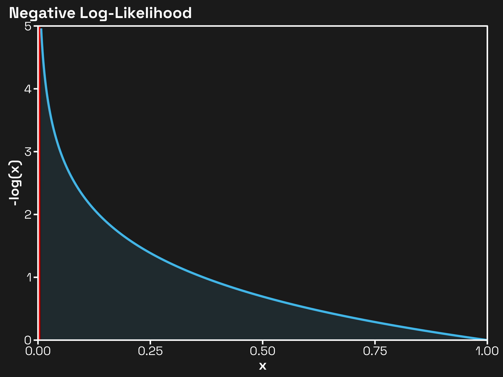



## Setting the Scene
Objective functions (AKA loss functions, cost functions, utility functions, etc.) are the guiding light behind machine learning. Without them, algorithms would be groping in the dark, which definitely isn't what we want (it would lead to quite bad ML models and be a PR nightmare).

The discussion of objective functions here is especially pertinent because of the *AI alignment problem* coming out of the field of AI safety, an area I'm inextricably involved in. Put simply, the AI alignment problem states that we currently have no means of assuring that the values of an AI system align with those of humanity. This, according to AI x-risk enthusiasts[^1], is quite concerning; it means that if we were to produce a superintelligent AI, it very well might want to take over the universe and learn to view humanity as a crutch, ultimately deciding to eradicate us all (except for me, because I am really cool and likable, and of course you the reader as well, because you are also very cool and likable).

This would, of course, be tragic, as without the rest of humanity, there'd be nobody left to notice how cool and likable you and I are. Also, I want to note that I do not that I don't especially buy into the AI alignment problem, for reasons the government may or may not be forbidding me from getting into[^2]. But I digress. I find it interesting that objective functions don't come up as much in discussions surrounding AI alignment. 

**Proposal**: if we can just get the objective function *just right,* we'll be able to guarantee that the model can only move *towards* being aligned with humans. Why doesn't this proposal work? Basically, it's not as straightforward as getting the reward function "just right." 

Take [reward hacking](https://en.wikipedia.org/wiki/Reward_hacking). Put simply, reward hacking is an alignment failure wherein a reinforcement learning agent—through policy optimization—discovers and exploits a misspecified proxy reward function to maximize its expected return, thereby converging on a degenerate policy that is optimal for the given reward signal but misaligned with the designer's latent objective. A bit more technically, reward hacking is when an agent finds a clever loophole to get the maximum reward without actually accomplishing the real goal. The underlying problem is that humans tend to design reward functions that are *intuitively* good proxies for ideal behavior, but contain corner cases that leave them susceptible to exploitation. Thus, one might be inclined to call for the creation of a *science* of objective functions, a rigorous methodology to better define for machines what our goals are. I do not call for this.

## Why an "art"—not science—of objective functions?
> "Learn the rules like a pro, so you can break them like an artist. — <cite>Pablo Picasso</cite>" <br> 
> — <cite>Jack Sanderson (alright, [maybe not](https://imgur.com/wise-words-of-michael-scott-xByII))</cite>

I don't think there's much to say about the "science" of objective functions. In my view, most of the current work on objectives is already scientific, driven more by theory than beauty, but mostly by empirical results. It's time we brought in some aesthetics from information theory to make this discipline more attractive.

Despite my early introduction of reward hacking, I don't actually care about it; I leave solving reward hacking as an exercise for the objective function scientists of the world. Concretely, what I'm interseted in is a) the information-theoretic intuition behind objective functions, and b) the outcomes we should *expect* given these intuitions.

### The Archetypal Example
Say we're calculating the loss of a language model (LM) over a sequence of tokens \(x_{i:n}\). We typically do this with the *cross-entropy loss* (equivalent to negative log-likelihood) as given here:
\[
\mathcal{L}(x_{1:n}) = - \sum_{i = 1}^n \log p(x_{i} | x_{1:i})
\]
In English, the LM's loss over the whole sequence is equal to the negative log-probability of token \(i\) givne all tokens up to \(i\) as input. Why negative log-likelihood? Consider its graph on the interval \((0, 1]\):


Hopefully, the graph makes clear why negative log-likelihood is a great loss function. As our input \(x = p(x_i | x_{1:i})\) gets closer to \(1\), the loss approaches \(0\), meaning the higher the probability our LM assigns the correct token, the less it'll be penalized. On the other hand, as \(x\) gets closer to \(0\), the loss blows up, asymptotically approaching infinity. It is for this reason that LLMs are often dubbed "next-token predictors," as the *base* LM indeed is only trained on next-token prediction (NTP). 

What can we glean from this objective function? Well, one reasonable conclusion is that a powerful LM trained purely on NTP (this is often called a base model or pretrained model) is going to be good at *modeling language.* Given some input tokens, it will skillfully be able to produce new tokens that are highly reasonable when conditioning on the input. On the other hand, there's absolutely no reason we should expect this model to be good at conversing with users. Say we prompt it with a question:
```
Q: What is the capital of France?
```
It wouldn't be unreasonable for the base LM to begin its completion with either of these two strings:
```
A1: The capital of France is Paris.
A2: What is the capital of Germany?
```
Why do I claim this? Because these models are trained for NTP over the entire internet, which likely contains *both* pairs of questions and answers *and* long lists of questions. (If you'd like to go a bit deeper into the world of pre-training and instruction-tuning, I recommend [this article](https://mlops.community/basics-of-instruction-tuning-with-olmo-1b/), which also contains some funny completions straight from a base model.) 

The point here is that just from the objective function, we can start to reason about how we expected a model trained on such an objective will act. The goal of this series is to understand the interplay of these objectives in multi-stage training processes (and dig into some more complicated objective functions?).

https://x.com/ESYudkowsky/status/1968353926035783830


[^1]: Not that they're enthusiastic about the notion of AI-induced existential risk, but that they're especially interested in mitigating it.
[^2]: Alright, maybe it's not the "may".


