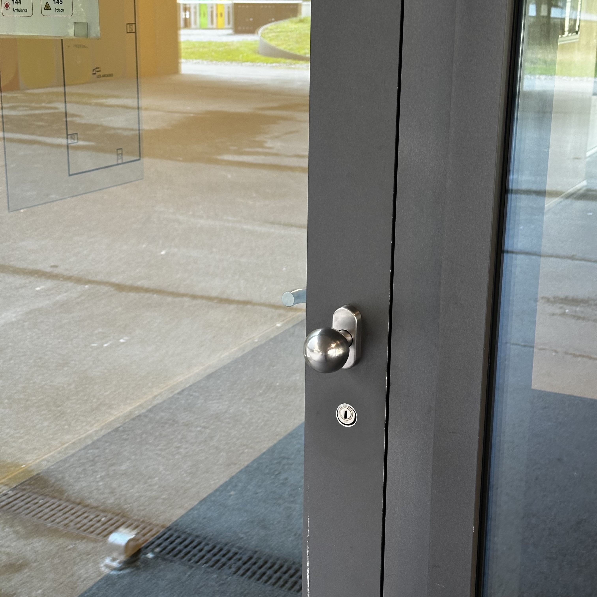
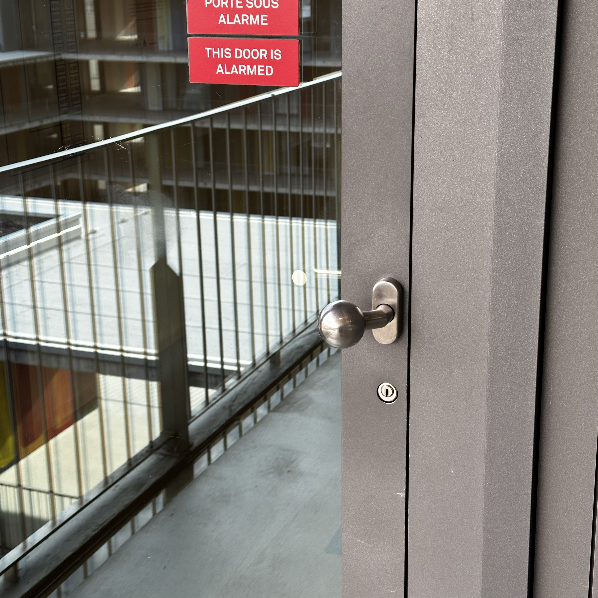
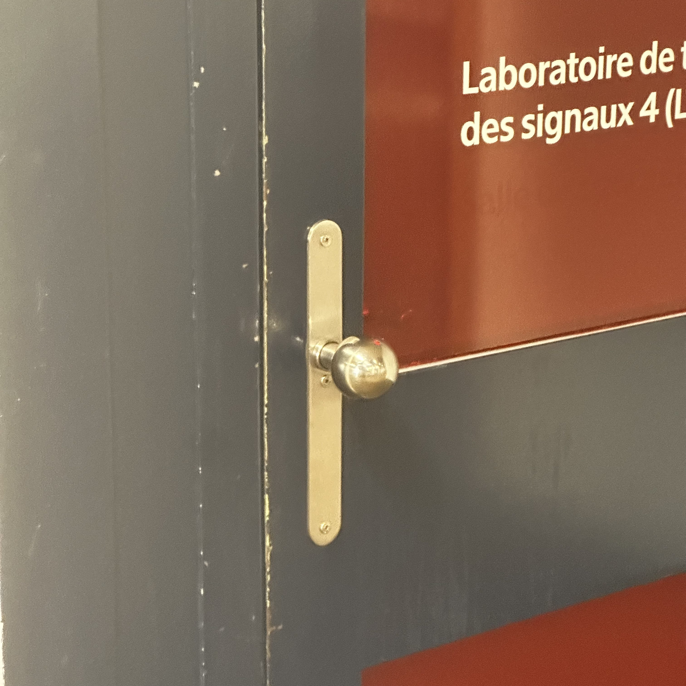
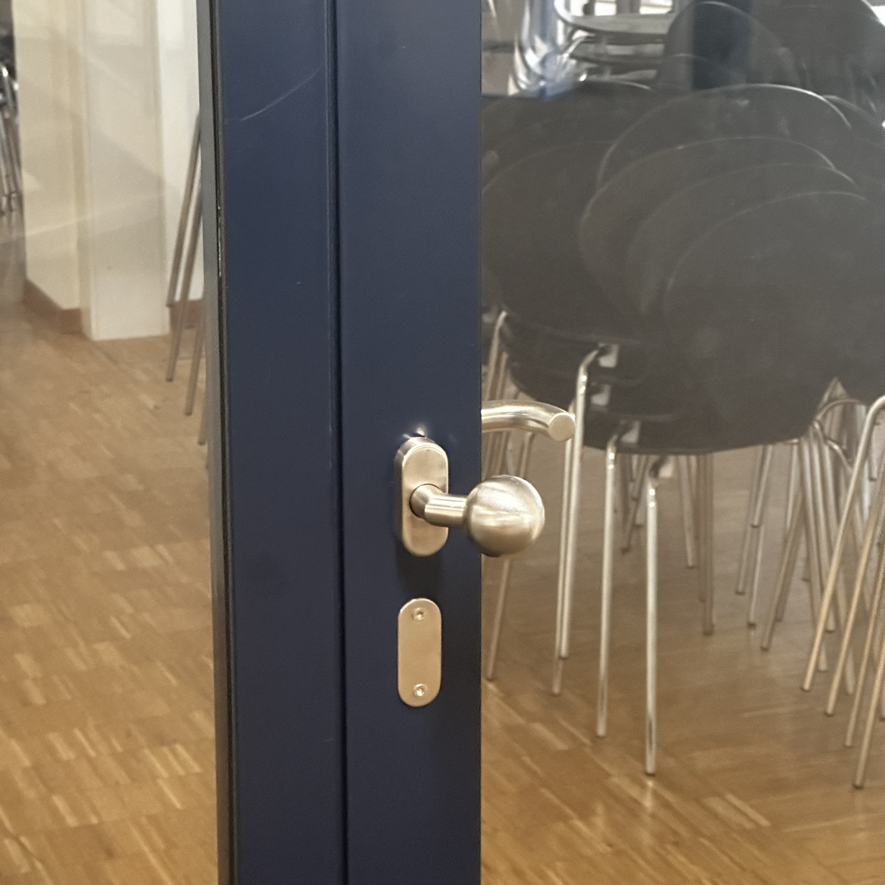
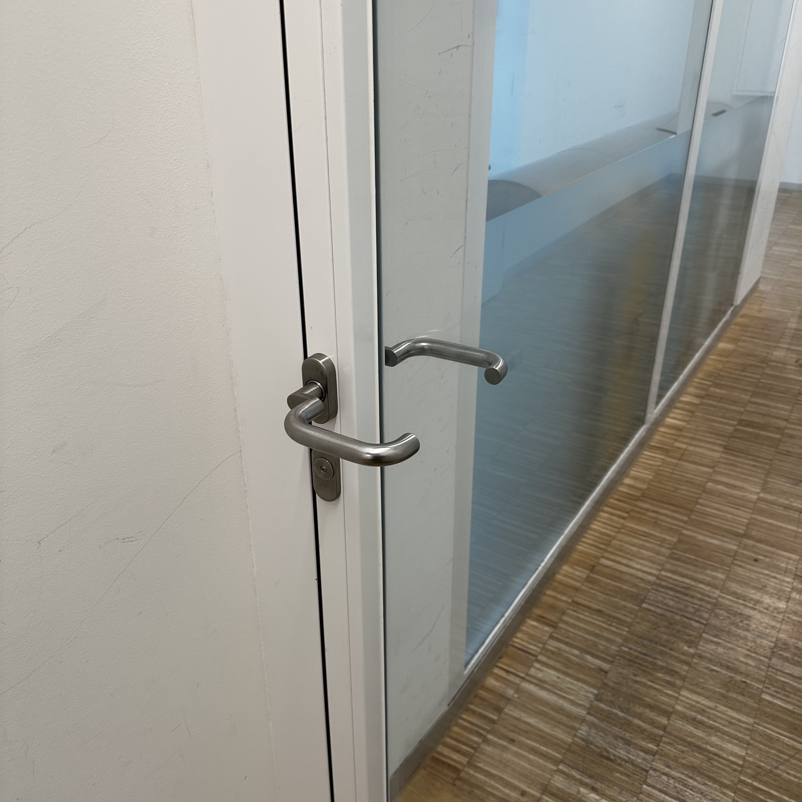
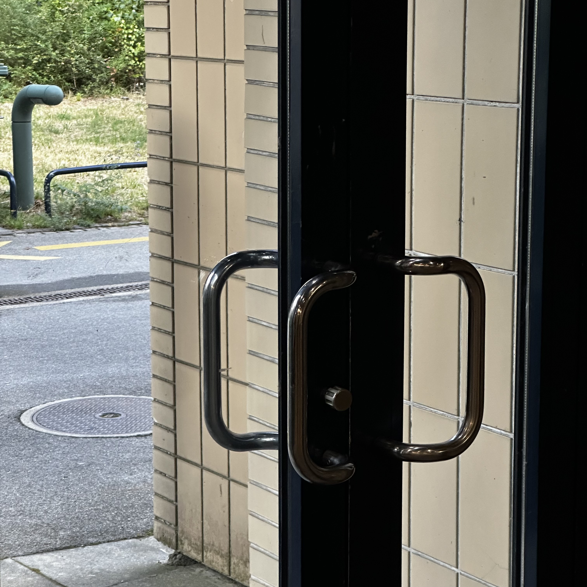
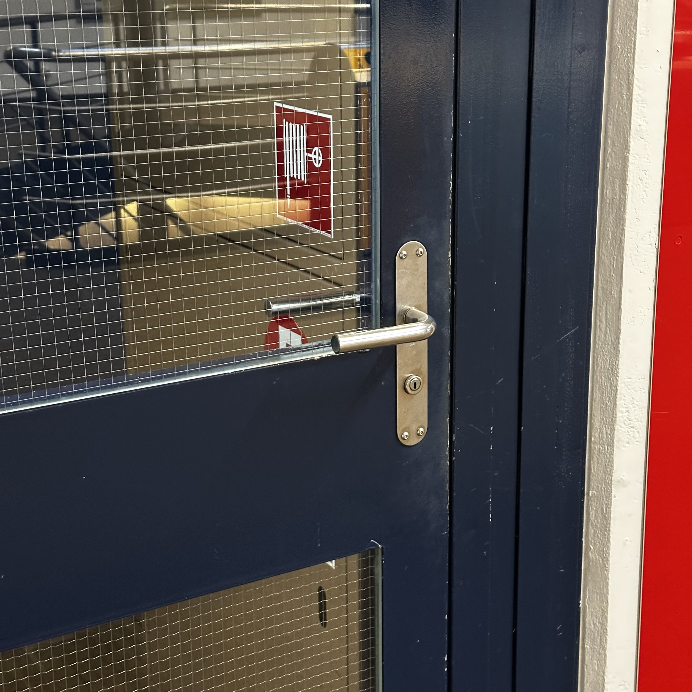
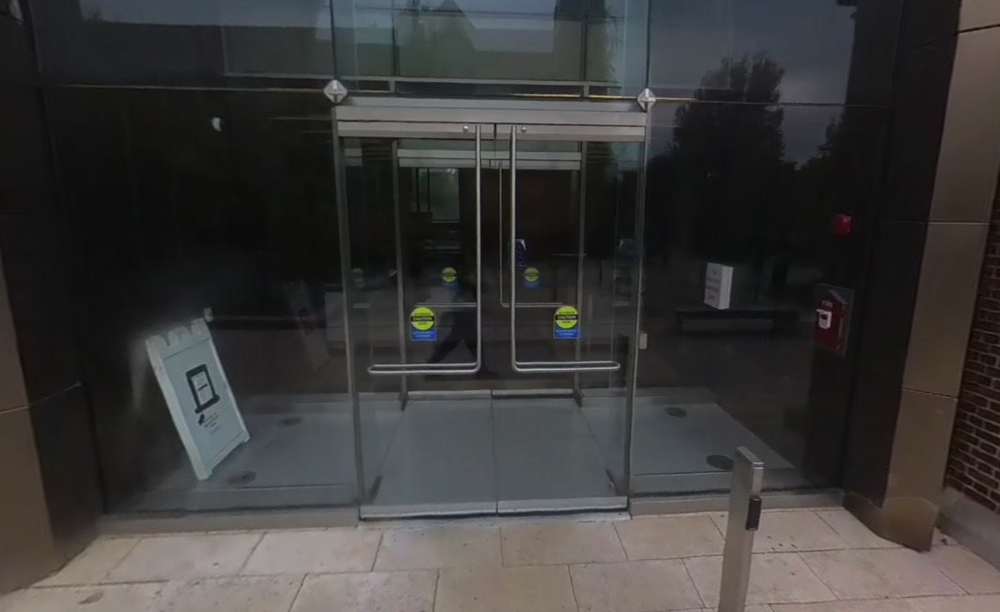
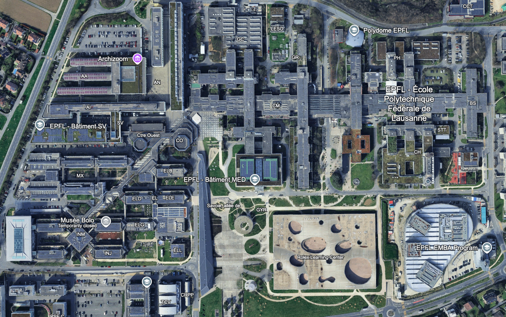
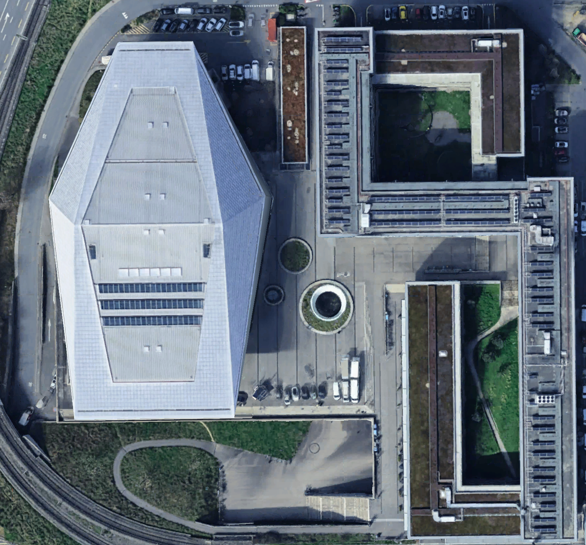

This summer I interned at EPFL, which is located in Lausanne, Switzerland. This of course meant that I was living in Switzerland for a month. What was hot, and what was not?

## The Local Transit: Hot

It's well-known that transit in Europe blows (most) transit in the US (generally) out of the water. Even Lausanne---a proper population of around 150,000 and a metro population of less than 500,000---has (debatably) two metro lines[^metros] both of which run often sub-ten-minute headways from early morning to late night. And that's despite it being inexplicably single-tracked. **Verdict: hot.**

## The Local Transit's Hours of Operation: Not

When the local transit *is running,* it's great. However, much of Lausanne's (and Geneva's, and Zurich's) transit just completely stops running bewteen midnight and 1 AM. This somewhat notoriously confuses American transit enthusiasts who are used to system like the Chicago 'L' or NYC subway which have some or all lines run 24/7, with fairly strong 24/7 bus service as well. It feels silly that you can be *downtown* in a major *Swiss* city at 1 AM, and your only option to get home may be an... infrequent night bus. **Verdict: not.**

## The Doors: Not

I have no problems with [The Doors](https://en.wikipedia.org/wiki/The_Doors), I mean the literal doors; let me explain. 

Consider this door handle:

{style="width:80%; margin: 0 auto;"}

If you walked up to this door, based solely on the handle, would you assume it's a push or a pull? At first I was basically 50/50 split on which, but after using the door I can confirm it's a pull. Now consider this door handle:

{style="width:80%; margin: 0 auto;"}

Would you guess this is a push or pull? Well it turns out its a push! I guess the difference is that this handle has that slight bend, which signals its a push. Now consider this one:

{style="width:80%; margin: 0 auto;"}

The knob comes straight out, so based on the previous door, this should be a pull. And it is! Finally this door:

{style="width:80%; margin: 0 auto;"}

This one has a slight bend, just like the second, so it must be... that's right, a *pull!* There's *no consistency between push and pull door handles!*

What might be even worse is these kinds of handles:


  
  
  


So many doors in Switzerland have the exact same handles on both sides, leaving the handle absolutely useless for determining if the door is a push or pull. Now, there's still a way to differentiate push and pull doors by looking at the hinges (if the hinges are on your side of the door, it's a pull). However, this forces you to move your eyes away from the target of the handle to the complete other side of the door, check to see if there are hinges, then move your eyes back. A complete waste of half a second of my life.

Why not just adopt the "horizontal handle = push" and "vertical handle = pull" convention the US has largely settled on? I feel almost all (non-residential) doors follow that pattern---who doesn't love a good [crash bar](https://en.wikipedia.org/wiki/Crash_bar)? Switzerland, apparently. **Verdict: not.**

(To be fair, the US isn't perfect here. Consider the oft-bemoaned (by me) Saieh Hall main entrance doors at UChicago:

{style="width:80%; margin: 0 auto;"}

Both horizontal and vertical---great! But generally speaking, the US is much better here.)

## The Bread: Hot

"American" bread is maybe the only invention worse than Swiss doors. I'm talking about that soft wonderbread-inspired stuff:

{style="width:80%; margin: 0 auto;"}

Nothing about it feels like it existed before 1950. You can still find this stuff in Europe, but luckily the real, slightly-tough-and-quick-to-spoil-but-so-much-more-pleasant-to-eat bread is just as common, and quite cheap. **Verdict: hot.**

## The State of Air Conditioning: Not

If you weren't aware, Europe had a [very rough summer](https://en.wikipedia.org/wiki/2026_European_heatwaves) in terms of heat. I was in Lausanne for over 10 weeks, and there was *not a single day* where the temperature was less than the historical average, and there were multiple periods where highs would be above 90 F (32 C) days straight (for context, the average daily high is around 75 F, or 24 C). The best part is that almost no buildings have air conditioning! 

I understand that historically, Europe had maybe a handful of days with 90+ degree weather, but I can only hope that last year's and this year's summers serve as warning calls that new buildings should have *some* form of air conditioning if the continent wants to remain pleasant to live and work in during the summer. **Verdict: not.**

## The Urban Fabric: Hot

It's nice that most infrastructure in the city proper is built with people in mind.

## The Trees: Not

As in, there are "not" trees. Okay, there are trees, but for some reason very few in places where people, like, exist outside. Take a look at the Google Earth view of EPFL's campus:

{style="width:80%; margin: 0 auto;"}

You might notice some patches of grass and a lot of concrete, but overall not many trees. That is because, well, there aren't many. Apart from that tiny corner northeast of campus, the only trees in these images are short and definitely do not provide any semblance of "shade." 

Again, I understand that for a while this region of Europe didn't have to deal with summer highs north of 95 degrees Fahrenheit. However, extremely hot summers are now a reality, and it's somewhat perplexing why *new developments* that contain large, public open spaces contain very little nature and even fewer trees! Take the recent "SwissTech" campus that was built 10 years ago just north of EPFL: 

{style="width:60%; margin: 0 auto;"}

No trees! The plaza is literally 100% Asphalt! If a city or developer proposed something like that in the US today, I think most people would be up in arms.

Trees are great at helping humans deal with the weather at all times of the year: in the summer, they block the sun and cool the ground below them, and in the winter they shed their lives and let the weaker sun shine through. It's not often that you can have your cake and eat it; Europe needs to learn how to plant these things. **Verdict: not.**

## SBB CFF FFS: Hot

For those unaware, SBB CFF FFS is Switzerland's national railroad company. Why the three acronyms? Well each is the acronym for "Swiss Federal Railways" in three of Switzerland's official languages: Schweizerische Bundesbahnen (German), Chemins de fer fédéraux suisses (French), Ferrovie federali svizzere (Italian). (Sorry, Romansh). Already pretty cool, right?

The even cooler thing about SBB is that they run on time, like *very* on time. In 2025, SBB trains have a punctuality percentage of 94.1%, i.e., across all stops, 94.1% of trains no later than 2 minutes of the scheduled arrival time. For context, French TGVs have a punctuality around 80%, while Germany's Deutsche Bahn punctuality is around 60%.[^punctuality] Sorry, Germany.

But it gets better than SBB always being on time. They have a system called "Taktfahrplan"---"regular-interval timetable"---which makes it *extremely* easy to plan train trips. The core idea behind this system is that trains should arrival and depart at... regular intervals. For example, say you want to get from Lausanne to Zurich, leaving sometime after 8:00. You could take the IC1 out of Lausanne at 8:17. Or you could take the IC5 out of Lausanne at 8:34. Or you could take the IC1 out of Lausanne at 9:17. Or you could take the IC5 out of Lausanne at 9:34. Or you... well you get the idea. The Taktfahrplan is incredibly convenient.

The final thing I'll rave about is that you can take transit just about *anywhere* in Switzerland. Any town that is inhabited year-round has a right to transit, and boy do these towns use that right. 

There is one downside to the Taktfahrplan and the extensiveness of Switzerland's railway network: the trains are only moderately fast. The IC1 from Geneva to Zurich takes about 3 hours. The TGV Lyria from Geneva to Paris also takes about 3 hours. However, Zurich is *100 miles closer to Geneva* than Paris is (as the crow flies). The Geneva to Paris train makes up time on the LGV Sud-Est high-speed rail line, which the Lyria can barrel down at 300 km/h (186 mph); Switzerland has no comparable high-speed rail lines. This discrepancy is because Switzerland has prioritized creating a reliable, extensive, and easy-to-use rail network over a fast one. (Germany did the opposite, and look where it got them punctuality-wise.) And indeed, SBB's extensiveness and punctuality are great. But considering the IC1 from Geneva to Zurich goes through four of Switzerland's five largest cities (Geneva, Lausanne, Bern, Zurich), a high-speed line would be really great. 

At the end of the day, though, SBB is awesome. **Verdict: hot.**

[^metros]: Lausanne has two subways, the M1 and M2. The older M1 is technically classified as "light rail" given that it shared some of its infrastructure with the street, but in terms of "vibe," it feels between "light rail" and "metro". Yes, it crosses the street at some points and shares some road infrastructure---which would suggest a light rail classification---but it always has signal priority, runs at much higher speeds than trams, and has high-floor level boarding. Maybe we need a [new competing standard](https://xkcd.com/927/).

[^punctuality]: It's hard to find very definitive numbers for these other coutry's train service punctuality percentages. This is probably because---especially for Germany---they definitely aren't worth advertizing.
