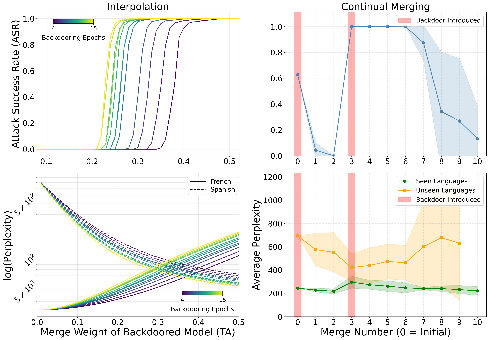
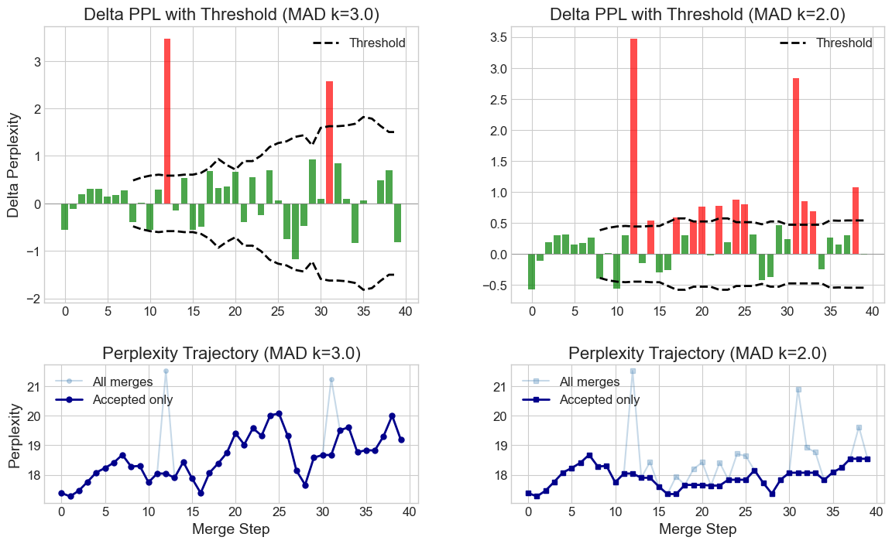

## Motivation
The increasing cost of training neural networks incentivizes community-driven model development: a paradigm in which the computational burden of training a single model, which is typically taken on by a single organization, is shared among many organizations. Model merging is a natural approach to enable such community-driven model development. In the model-merging paradigm, multiple models can be fine-tuned from a common base model and merged together to combine the skills of each individual model. This paradigm can enable multiple parties to develop model "forks" and propose model "merges," introducing opportunities for decentralized, collaborative model development.

However, there has been little research into the robustness of these model merging-based systems. Therefore, we study the robustness of model merging in two realistic community-driven model development scenarios: 1) in the presence of malicious actors and 2) diverse "in the wild" model merge requests. Finally, we also propose a simple defense mechanism to preserve model utility in realistic continual merging settings.

---

## Malicious Actors
To study the role of "malicious" actors in the community-driven model development pipelines, we design a language model backdooring technique `BadMergingLM` (`BMLM`) following [Zhang et al. (2024)](https://arxiv.org/abs/2408.07362). We study if and how backdoors permeate in the model merging setting by using `BMLM` to backdoor a single model in a set of models later merged into one. To analyze the backdoor's elicitation dynamics in the final merged model, we conduct several experiments where we sweep our `BMLM` model across training epochs and merge weights.

Our results demonstrate that backdoored models trained for more epochs require lower merge weight to transfer the backdoor to the final merged model. We also see that the final merged model's perplexity on the various downstream domains similarly depends on merge weight and epochs of training. This suggests that even on intended tasks, the final merged model's task-specific performance is sensitive to the training and merging hyperparameters. We also demonstrate that backdoors introduced in continual merging scenarios persist through multiple subsequent clean merges.

*(Left) Attack success rate (ASR) and perplexity (PPL) of two-way merge with one model backdoored, interpolated over the merge weight of the backdoored model. As the backdooring epochs increase, the backdoor becomes easier to elicit and the perplexity on the backdoored model's task—Spanish—decreases.*

*(Right) ASR and PPL over continual merges of different models. With task arithmetic, backdoors in the initial merge only weakly persist, but backdoors in subsequent merges persist for 3–4 merges, albeit at the cost of a slight increase in perplexity on seen languages.*

---

## "In-the-Wild" Models
To study the feasibility of real-world community-driven model development, we download 40 random variants of Llama-3.1 8B from HuggingFace to assess their utility for boosting merged model performance. In a continual merging setting, we find that the perplexity of the "main" model increases over time. To combat this, we propose a simple outlier detection system: filtering out models that cause a change in perplexity in the post-merge model greater than some threshold (specifically, some constant of the median absolute derivation (MAD) of post-merge perplexity changes). The results are shown in the figur below. 

We find that this system is sufficient to keep model perplexity at a reasonable level with a low enough MAD constant (e.g., 2.0 above), however it fails to reliably catch backdoored models. Further, we find that knowledge transfer from the HuggingFace models to the main model is often weak or completely nonexistent, implying that model merging-based community-driven model development may be an impractical method to improving models in realistic scenarios.

